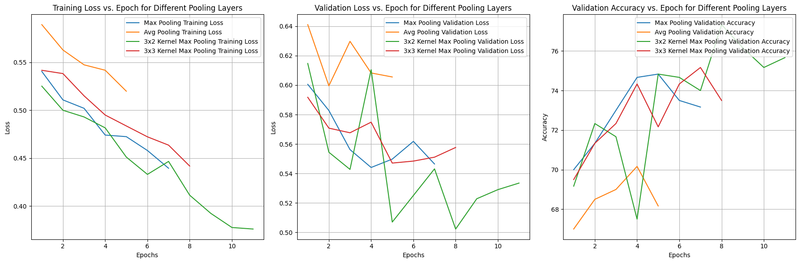
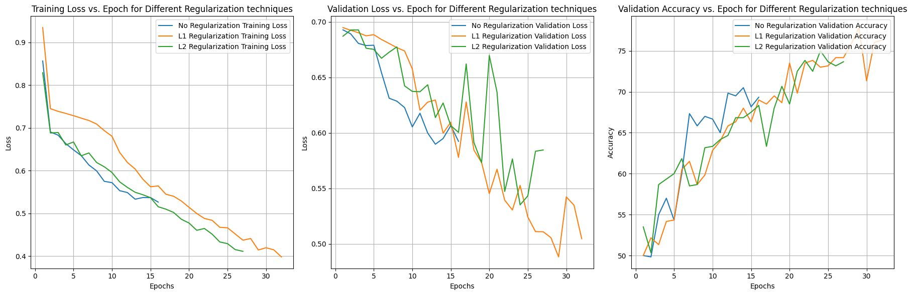
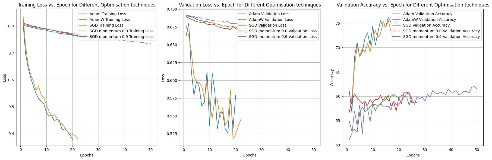
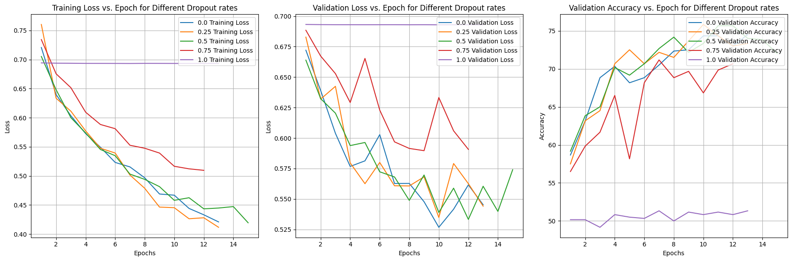
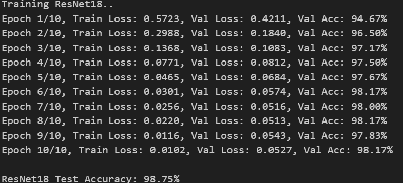

# Image Classification with CNNs & Transfer Learning

Group project focused on **binary image classification of cats and dogs** using PyTorch.

The project compares a custom Convolutional Neural Network trained from scratch with a pretrained **ResNet18** fine-tuned through transfer learning.

The complete workflow includes data augmentation, CNN architecture design, regularization and optimizer experiments, model evaluation, feature visualization, and transfer learning.

## Overview

The project investigates two approaches to image classification:

1. **Custom CNN from scratch**  
   A convolutional architecture was designed and experimentally modified through different pooling strategies, regularization methods, optimizers, and dropout rates.

2. **Transfer Learning with ResNet18**  
   A pretrained ResNet18 was adapted to the two-class problem and fine-tuned on the same dataset.

The main objective was to compare the learning behaviour and generalization performance of a relatively shallow network trained from scratch with a deeper model benefiting from pretrained visual representations.

---

## 1. Dataset

The dataset contains RGB images of cats and dogs divided into three balanced subsets:

| Split | Images |
|---|---:|
| Training | 2,000 |
| Validation | 600 |
| Test | 400 |

The two classes are approximately equally represented in each subset.

Images used by the custom CNN are resized to:

```text
3 × 150 × 150
```

where the three channels correspond to RGB values.

---

## 2. Data Augmentation

Training images are augmented to improve generalization and reduce sensitivity to small transformations.

The augmentation pipeline includes:

- random rotations up to ±15°
- random scaling between 80% and 120%
- random horizontal flipping
- resizing to 150 × 150
- tensor conversion
- channel-wise normalization

Validation and test images are resized and normalized without random augmentation.

---

## 3. Custom CNN Architecture

The custom classifier contains two convolutional stages followed by fully connected layers.

```text
Input: 3 × 150 × 150

Conv2D
3 → 32 channels
3 × 3 kernel
padding = 1
↓
ReLU
↓
Pooling
↓
Conv2D
32 → 64 channels
3 × 3 kernel
padding = 1
↓
ReLU
↓
Pooling
↓
Flatten
↓
Dropout
↓
Fully Connected: 128
↓
ReLU
↓
Fully Connected: 2
```

The final two outputs correspond to:

- Cat
- Dog

Training uses **Cross-Entropy Loss**.

---

## 4. Architecture & Hyperparameter Experiments

The custom CNN was used to investigate how several modelling choices affect validation behaviour.

### Pooling

The following configurations were compared:

- Max Pooling — kernel 2, stride 2
- Average Pooling
- Max Pooling — kernel 3, stride 2
- Max Pooling — kernel 3, stride 3

The **3 × 3 Max Pooling configuration with stride 2** achieved the strongest validation performance in the pooling experiment, reaching approximately **77.3% validation accuracy**.



*Training loss, validation loss and validation accuracy for the tested pooling strategies.*

### Regularization

The experiments compared:

- no explicit regularization
- L1 regularization
- L2 regularization

The exploratory results indicated that regularization could improve generalization relative to the unregularized configuration.



*Comparison of regularization strategies during custom-CNN training.*

### Optimizers

Several optimization strategies were investigated:

- Adam
- AdamW
- SGD
- SGD with momentum



*Training and validation behaviour across different optimization strategies.*

### Dropout

The following dropout rates were evaluated:

```text
0.00
0.25
0.50
0.75
1.00
```

The experiments showed the expected trade-off between regularization and information loss: moderate dropout could improve generalization, while excessive dropout severely degraded learning.



*Effect of dropout rate on training loss, validation loss and validation accuracy.*

---

## 5. Transfer Learning with ResNet18

The second part of the project uses a **ResNet18 pretrained on ImageNet**.

The final classification layer was adapted from the original ImageNet output space to:

```text
2 classes
```

The pretrained network was then fine-tuned on the cat/dog dataset using:

```text
Optimizer: Adam
Learning rate: 1e-4
Batch size: 32
Epochs: 10
```

Images were resized to:

```text
224 × 224
```

and normalized using the standard ImageNet channel statistics.

### Validation Performance

Validation accuracy increased rapidly during fine-tuning:

| Epoch | Validation Accuracy |
|---:|---:|
| 1 | 94.67% |
| 2 | 96.50% |
| 3 | 97.17% |
| 4 | 97.50% |
| 5 | 97.67% |
| 6 | 98.17% |
| 7 | 98.00% |
| 8 | 98.17% |
| 9 | 97.83% |
| 10 | 98.17% |

### Test Result

The fine-tuned ResNet18 achieved:

> **98.75% test accuracy**



*Validation performance during fine-tuning of the pretrained ResNet18.*

---

## 6. Custom CNN vs Transfer Learning

The experiments demonstrate the substantial advantage of transfer learning for this relatively small image dataset.

| Approach | Test Accuracy |
|---|---:|
| Custom CNN | ~72%* |
| **Pretrained ResNet18** | **98.75%** |

\*The notebook reports approximately 72% for the selected custom-CNN configuration. The custom-model experiments were exploratory and configuration-dependent, whereas the ResNet18 result is directly reproduced by the final evaluation cell.

The large performance difference highlights the benefit of using visual representations learned from a large-scale dataset rather than learning all image features from scratch using only a few thousand training examples.

---

## 7. Model Inspection

The project also investigates what the custom CNN learns internally.

The analysis includes:

- visualization of first-layer convolutional filters
- visualization of first-layer activation maps
- inspection of incorrectly classified images

These diagnostics provide qualitative insight into the features learned by the custom model and the types of examples that remain difficult to classify.

---

## Technologies

- **Python**
- **PyTorch**
- **Torchvision**
- **timm**
- Convolutional Neural Networks
- Transfer Learning
- ResNet18
- Computer Vision
- Data Augmentation
- Hyperparameter Experimentation
- L1 / L2 Regularization
- Dropout
- Adam / AdamW / SGD
- Model Evaluation
- Feature Visualization

---

## Repository Structure

```text
cnn-image-classification-transfer-learning/
│
├── README.md
├── requirements.txt
│
├── notebooks/
│   └── image_classification_cnn_transfer_learning.ipynb
│
└── figures/
    ├── pooling_comparison.png
    ├── regularization_comparison.png
    ├── optimizer_comparison.png
    ├── dropout_comparison.png
    └── resnet18_training.png
```

---

## Academic Context

**Course:** Advanced Machine Learning  
**Project type:** Group project  
**Contribution:** All stages of the project were jointly developed by the group members, including preprocessing, CNN implementation, experimentation, model evaluation and transfer-learning analysis.
